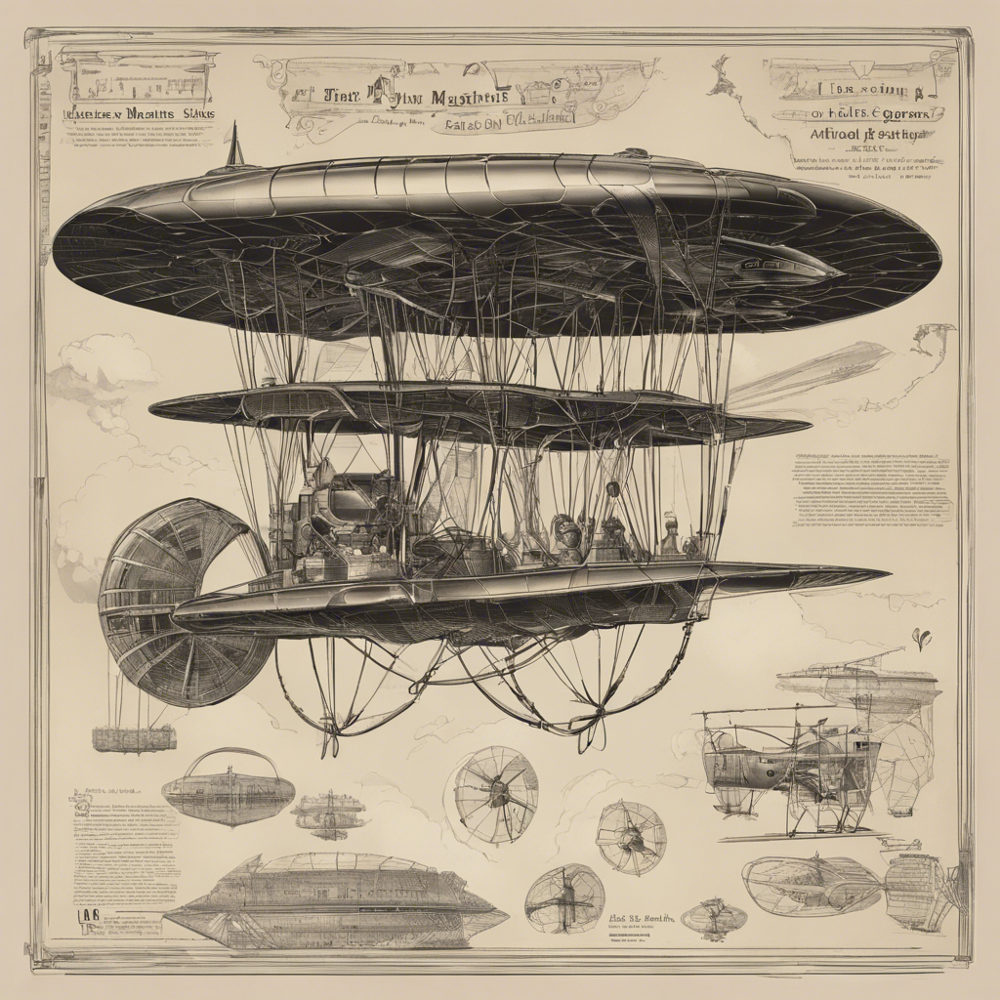

# Image Generation Django Application

This Django application generates images using Stability AI’s Text-to-Image generation API. The application utilizes Celery for parallel processing to manage asynchronous calls to the API. This project demonstrates how to integrate a third-party API into a Django application while using Celery for asynchronous task management.

## Table of Contents

- [Prerequisites](#prerequisites)
- [Installation](#installation)
- [Configuration](#configuration)
- [Running the Application](#running-the-application)
- [Usage](#usage)
- [Endpoints](#endpoints)
- [Response Format](#response-format)
- [Enhancements](#enhancements)
- [Troubleshooting](#troubleshooting)

## Prerequisites

Before you begin, ensure you have the following installed:

- **Python 3.11+**
- **Redis**: Redis should be installed and running as the Celery message broker. You can install Redis via package manager:
  - **Ubuntu/Debian**: `sudo apt install redis-server`
  - **macOS (Homebrew)**: `brew install redis`
  - **Windows**: Use Windows Subsystem for Linux (WSL) to install Redis.
- **WSL (Windows Only)**: If you are using a Windows machine, install WSL to run the Redis server:
  - Install WSL following the instructions [here](https://docs.microsoft.com/en-us/windows/wsl/install).
  - Once installed, open WSL and install Redis using the Linux package manager.

## Installation

Follow these steps to set up the project:

1. **Clone the Repository:**
   ```bash
   git clone https://github.com/arvindkr7/StabilityAI.git
   cd StabilityAI

2. **Create a Virtual Environment:**
    ```bash
    python -m venv venv
    ```
3. **Activate the Virtual Environment:**
    - **Windows:**
    ```bash
    venv\Scripts\activate
    ```
    - **Linux/macOS:**
    ```bash
    source venv/bin/activate
    ```

4. **Install Required Packages:**

   > *Make sure venv is activated
    ```bash
    pip install -r requirements.txt
    ```

6. **Apply migrations**
   
   > *Make sure venv is activated
    ```bash
    python manage.py makemigrations
    python manage.py migrate
    ```

## Configuration

1. **Environment Variables: Create a .env file in the root of your project directory and add the necessary configurations:**

    ```bash
    API_KEY=stability_ai_secret_key
    ```

## Running the Application

1. **Start the Redis Server:**
    ```bash
    sudo service redis-server start
    ```

     - **Verify Redis Server is running:**
        ```bash
        redis-cli ping
        ```
        You should see the below response
        > PONG

2. **Start the Django Server:**
   
   > *Make sure venv is activated
    ```bash
    python manage.py runserver
    ```

4. **Start Celery Worker Using Gevent:**

   > *Make sure venv is activated
    ```bash
    celery -A myproject worker -l info --pool=gevent
    ```


## Usage
Once the server is running, you can generate images by sending a request to the application using a web browser or any HTTP client like curl or Postman.

## Endpoints
### Generate Images
- URL: /image/generate/?prompts=
- Method: GET
- Query Parameters:
    - `prompts`: A comma-separated list of text prompts.

- Example:
    http://127.0.0.1:8000/image/generate/?prompts=flying machine,robotic dog
    
- Response: 
    ```json
    {
    "flying machine": "http://127.0.0.1:8000/image/result/00a219c3-7652-4927-854f-a69b1878e952",
    "robotic dog": "http://127.0.0.1:8000/image/result/5efeb5f0-4c7f-4f32-965b-9b813e115819"
    }
    ```

### Get Image Result
- URL: /image/result/<task_id>/
- Method: GET
- Example:
    http://127.0.0.1:8000/image/result/00a219c3-7652-4927-854f-a69b1878e952
    
    NOTE: This url is the same what you receive in the above response

- Response:
    ```json
    {
  "status": "Completed",
  "image_url": "http://127.0.0.1:8000//media/generated_images/flying_machine_TdPShVj.png"
    }
    ```


## Response Format

### Generate Images
Upon a successful request, the server responds with a JSON object containing the task IDs for each prompt:

```json
{
  "flying machine": "http://127.0.0.1:8000/image/result/00a219c3-7652-4927-854f-a69b1878e952",
  "robotic dog": "http://127.0.0.1:8000/image/result/5efeb5f0-4c7f-4f32-965b-9b813e115819"
}
```

### Get Image Result
You can retrieve the status and URL of the generated image using the task ID:

```json
{
  "status": "Completed",
  "image_url": "http://127.0.0.1:8000/media/generated_images/flying_machine_TdPShVj.png"
}
```

### View the generated image
Open the image_url in a web browser to view the generated image.
- Example:
    http://127.0.0.1:8000//media/generated_images/flying_machine_TdPShVj.png

    

## Enhancements

### AWS S3 Integration: 
- To use AWS S3 for storing images, configure your Django settings to use django-storages. Replace the local storage settings with the following:
    ```python
    DEFAULT_FILE_STORAGE = 'storages.backends.s3boto3.S3Boto3Storage'
    AWS_ACCESS_KEY_ID = 'your_aws_access_key_id'
    AWS_SECRET_ACCESS_KEY = 'your_aws_secret_access_key'
    AWS_STORAGE_BUCKET_NAME = 'your_bucket_name'
    AWS_S3_REGION_NAME = 'your_region_name'
    ```

## Troubleshooting

- **Task Pending Status:** Ensure that the Redis server is running and correctly configured. Check the Celery worker logs for any errors.

- **Windows Compatibility:** If you encounter the set_nonblocking() error on Windows, ensure that you are running Redis through WSL or use Docker to run Redis.

- **Client Error:** You may encounter client error in case request limit exceeds as per set by StabilitAI

## Conclusion
This application serves as a foundation for integrating third-party APIs with Django and Celery. You can extend this project by adding features such as user authentication, more image processing options, and enhanced error handling.


